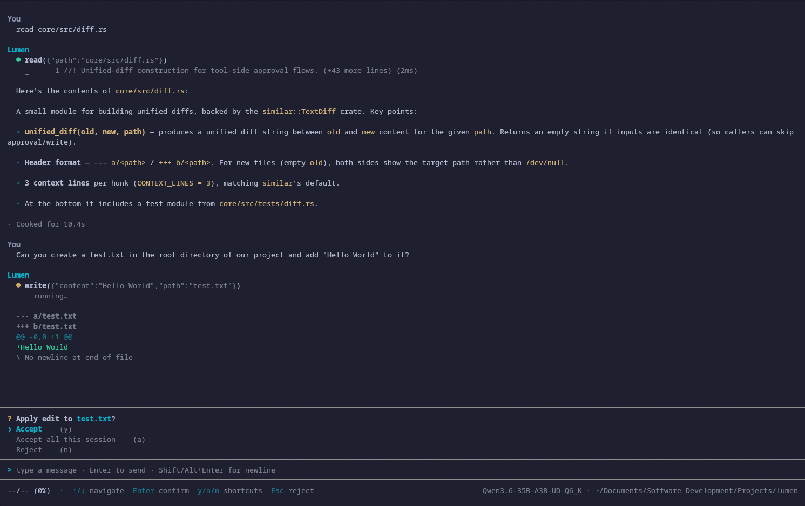

<p align="center">
  <h1 align="center">lumen</h1>
  <p align="center">A token-efficient, local-LLM-first coding agent CLI. Claude Code "light" with Pi-style modularity.</p>
</p>

<p align="center">
  
</p>

Rust workspace; talks to llama.cpp's `llama-server` out of the box
and to any OpenAI-compatible endpoint (llama-swap, ollama, vLLM,
OpenAI, Anthropic-via-proxy, ...) through the same path.

Built primarily for personal use; published in case it's useful to others.

> **Status: v0.1 code-complete.** Install from source (see [Installation](#installation)). Package distribution to AUR / crates.io is intentionally deferred - see [`docs/DESIGN.md`](docs/DESIGN.md#locked-decisions).

## Why

- **Local-first**: built around llama.cpp; no cloud account required to use.
- **Token-efficient**: stable prompt-cache prefix, symbolic retrieval (ripgrep + tree-sitter + LSP) instead of vector RAG by default, token-aware working-set budget (Phase 2).
- **Provider-agnostic**: `Provider` trait abstracts the transport so swapping llama.cpp → Anthropic → OpenAI is a config change, not a refactor.
- **Strict `core` / `cli` boundary**: agent + tools + session live in `lumen-core` with zero UI deps; `lumen-cli` is the ratatui front-end. The compiler enforces the separation.

## Prerequisites

- Rust toolchain (see [`rust-toolchain.toml`](rust-toolchain.toml))
- `rg` (ripgrep) on `$PATH` for the Grep tool
- A running OpenAI-compatible LLM endpoint. Most common:
  - [`llama-server`](https://github.com/ggerganov/llama.cpp/tree/master/examples/server) from llama.cpp, listening on `http://localhost:8080` by default

## Installation

### From source

```sh
git clone https://github.com/ecdevv/lumen.git
cd lumen
cargo build --release
cargo run --release            # launches the TUI against the configured endpoint
```

### Cargo install

```sh
cargo install --path cli
```

Drops the `lumen` binary into your Cargo bin directory (typically
`~/.cargo/bin/`).

## Configuration

Lumen reads a layered config: defaults → `~/.config/lumen/config.toml`
(XDG; created on first launch with documented defaults) → `LUMEN_*`
env vars → CLI flags. The most common knobs are exposed live via
the `/settings` slash command in the TUI; `/model <name>` switches
the active model and persists to the config file.

Common keys:

```toml
auto_apply = "never"          # "never" | "safe" - see below

[provider]
base_url = "http://localhost:8080"
model    = "default"
api_key  = ""                 # leave empty for local servers

[ui]
auto_copy_on_select = true    # OSC 52 clipboard on drag-release
unicode_glyphs      = true    # set false for legacy terminals
```

`auto_apply` controls only file edits:

- `never` (default) - prompt before every edit
- `safe` - auto-apply edits inside CWD; still prompt for edits
  outside CWD

Shell commands always prompt under both modes - there is no
auto-shell tier in v0.1. Per-command allowlisting is the future
shape for trusting specific shells.

## Inside the TUI

- `Enter` submits; `Shift+Enter` / `Alt+Enter` insert newline
- `/` on empty input opens the slash palette
  - `/help`, `/clear`, `/quit`, `/model`, `/settings`
- `Esc` / `Ctrl+C` cancel turn → clear input → quit (each press has context-aware semantics)
- `Ctrl+D` quits from anywhere (always available, even inside modals)
- `Shift+Tab` cycles approval mode (`never` ↔ `safe`)

## Docs

- [`docs/ARCHITECTURE.md`](docs/ARCHITECTURE.md) - how the code is wired
- [`docs/ROADMAP.md`](docs/ROADMAP.md) - phases, current progress, future considerations
- [`docs/DESIGN.md`](docs/DESIGN.md) - locked decisions, tech stack, cross-cutting rationale
- [`CLAUDE.md`](CLAUDE.md) - Claude Code guidance (project conventions)

## License

Dual-licensed under MIT or Apache-2.0 at your option.
